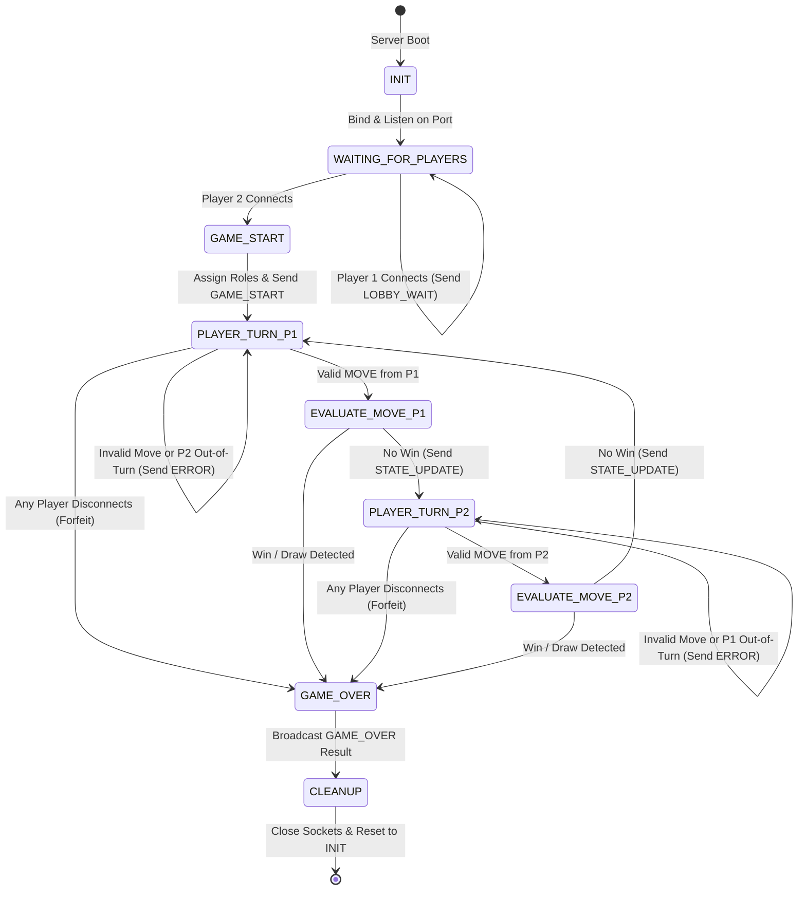

# Connect 4 Server State Machine 

## Game State Machine Diagram
This Finite State Machine tracks the server-side lifecycle of the Connect 4 match!

### State Machine Logic
The server steps through the following definitive states:
* `INIT`: The server allocates memory for the 6x7 grid, zeroes out game variables, and prepares network sockets.
* `WAITING_FOR_PLAYERS`: The server accepts the first TCP connection, transitions into a holding state (LOBBY_WAIT), and waits for the second connection.
* `GAME_START`: Triggered exactly when the second player connects. Assigns Player 1 as "X" and Player 2 as "O".
* `PLAYER_TURN` (P1/P2): The server blocks and waits for a MOVE payload. It validates the sender ID against the active turn identifier.
* `EVALUATE_MOVE`: The server applies gravity to the submitted column index (dropping the disc to the lowest empty row) and scans the 4 intersecting axes for a 4-in-a-row alignment or a 42-move board draw.
* `GAME_OVER`: Broadcasts the final result (WIN, DRAW, FORFEIT) and the winning player.CLEANUP: Sever connections cleanly, release port bindings/threads, and reset the board array to prepare for the next lobby.
## Error Handling, Edge Cases & Disconnect Transitions
To prevent server crashes or deadlocks, the FSM explicitly catches and handles the following failure paths:

## Invalid Moves & Out-of-Turn Actions
If the server is in `PLAYER_TURN_P1` and receives a `MOVE` from Player 2, or if Player 1 selects a column that is already full or out-of-bounds (<0 or >6), the FSM does not transition to `EVALUATE_MOVE`.
* Action: It traps the state, emits an ERROR message directly to the offending client, and immediately returns to awaiting valid input for the current turn.

## Abrupt Mid-Game Disconnections
At any point during `WAITING_FOR_PLAYERS`, `PLAYER_TURN`, or `EVALUATE_MOVE`, a client may drop abruptly.
* Action: The socket exception triggers an immediate forced transition directly to `GAME_OVER`. The server generates a synthetic forfeit event, declares the surviving connection the winner, broadcasts the result, and immediately moves to `CLEANUP`.